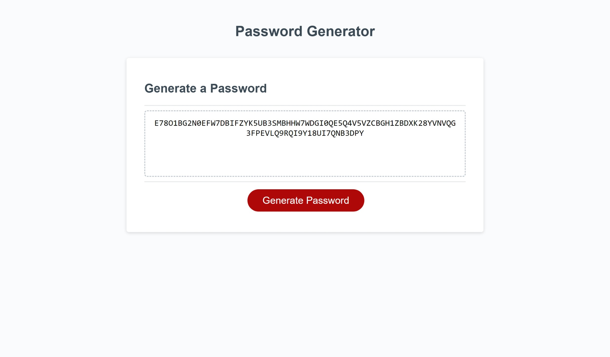

# Pa55w0rdMAker

## Description

This webpage was made using HTML, CSS, and Javascript. The purpose of this webapge is to allow users to generate a password to thier selected parameters. Users can select the length as well as which character types they would like incorporated in thier password. Users get to choose if they want uppercase letters, lowercase letters, numbers, or special characters. Once they answer all the prompts, their new password will be displayed on the page.

## Installation

N/A

## Usage

To use this page, press on "Generate Password" button and answer the prompts.
   

## Credits

N/A

## License

N/A